今天是年后爸妈开始上班的第一天，难得自己在家静下来，适逢窗外大雪纷飞，便想来总结一下刚刚过去的 2021。这一年对于我来说可谓是意义非凡，像是用一年的时间体验了校园恋爱的浓缩精华版。返校前跟同学聊天谈到 work life balance 的时候还打趣到，研究生阶段通常有四方面的事情要处理：科研、社工、课程、生活，每一年一般都只能挑两担，第一年是社工和课程；第二年是科研和社工；第三年是科研和生活；到第四年，也就是今年，则全是生活再加一点点科研了哈哈。跟小邵同学在一起着实带给了我别样的经历，重新让我认识到了校园恋爱的美好。

---

### 生活

#### 感情

从去年留校过年开始，和小邵同学的关系就莫名近了起来，一起贴春联、一起买菜、一起做年夜饭，到后来一起出校散心、一起吃饭、一起看电影，甚至每天下班都要一起从实验室离开，一切都非常自然地发生了。虽然后来得知小邵有意靠近，但我当时确实也抱着多接触尝试一下的想法，就这样开始了**难得的双向奔赴**。不过说实话我非常不擅于处理这种暧昧关系，害怕点破，害怕不成的话两个人都尴尬，也不确定自己是否真的适合。清明回家的时候，跟爸妈说起这个事，爸爸问我们认识多久了，我说得有七年了，爸爸直接说那估计没什么戏，这么长时间都没发展... 当时的心情也确实挺复杂的，经常躺在床上翻来覆去思考这个事情，也跟很多同学讨论过这个事情，得到了各种各样的答案。

就这样纠结着暧昧到了五一，好不容易有个假期，约好和小邵去成都玩，我意识到如果要进一步发展的话，这可能是我最后的机会了。暧昧的阶段虽然也很愉快，但很多事情想一起做却又要藏着掖着，在意身边同学的目光，还是有很多顾忌。于是在成都表白的计划逐渐在心中萌生，要说最终促使我下定决心的还是马哥，临出行前分别的「战前动员」可谓是太到位了。为了这次表白我也是思考了很多，怎么说、在哪说、氛围怎么营造，考虑了多种方案，还提前准备了表白成功的话要送的礼物。虽然最终并没有按照我设计的剧本展开，但好在一切都很顺利，**在成都廊桥的晚风中，我们在繁华的酒吧街旁独享属于我们的静谧**。

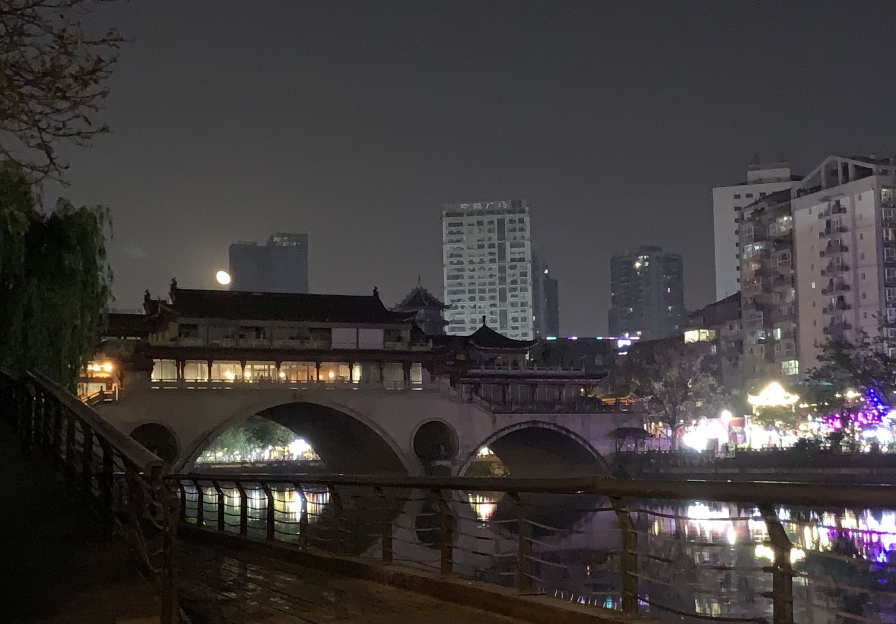

表白时夜晚廊桥的景致

在成都的旅行是非常幸福的，第二天去看大熊猫的时候，看着一身清爽可爱装扮的小邵，我一时间甚至不敢相信我们已经是男女朋友了。旅行的过程也愈发让我感受到性格的匹配，都能够享受走走停停随意的旅行路线，不需要过多的规划，更重要的是享受在一起的当下。从成都回来的路上，我们官宣了这段关系，很开心收到了大家的诸多祝福。在这之后，我们的关系就像走上了快车道，迅速升温。我第一次**感受到甜蜜的校园恋爱是什么样的**， 原来每天腻在一起也不会厌倦，小邵不时的任性和可爱都能让我会心一笑。为了维持这段感情，我们也付出了很多的努力，值得一提的是每月 1 号纪念日的时候开家庭会议，总结上个月做了什么事情，以及互相做的好和不好的方面，这极大地帮助了我们疏解内心对于对方的不满，避免这种小怨气积攒起来遇到导火索爆发。我们的关系也非常平稳地发展，从刚开始你侬我侬，到逐渐坦白之前的感情经历（虽然有些经历让人血压飙升），再到互相交心吐露性格的弱点，最后形成亲人一样的信任和联结。虽然目前离最后一步还差一些，但能感受到互相都在努力。我非常喜欢小邵什么事都不藏着掖着的性格，有什么事一直是当天解决，不留到第二天，同时我们也都不是会去赌气的人，把话聊开了就过去了，坚决避免冷战。

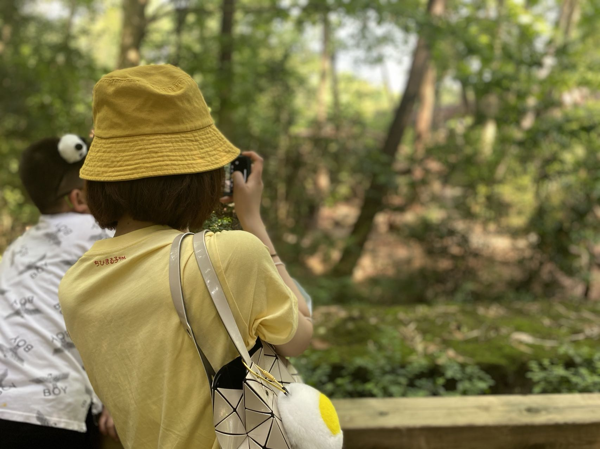

在成都看大熊猫

回顾这半年多的感情生活，绝对是非常幸福的，能感受到和一个观念相合的人在一起有多么重要，不用事事揣测对方的想法，按自己的习惯行动往往就是对方所期望的，这样也使得在难过和失落的时候能够互相理解，从而提供情感上的支持。当然这一路也不是完全一帆风顺，也有不少次的争吵，还有其他方面比较尴尬的事情。但正如之前所说，争吵每次都能在当天解决，这反而成为一步一步磨合的垫脚石。相比之前，在一起后生活丰富多彩了很多，发展了每天写开心日记的习惯，一起看剧、一起打游戏，互相融入对方的兴趣，**很多事情两个人一起做乐趣不止翻倍**，相信现在的我们能够继续携手向前，走向属于我们的未来。

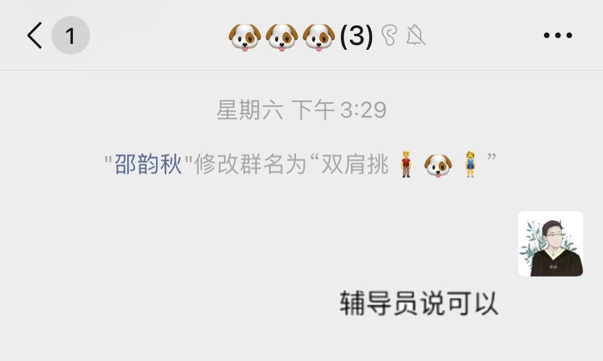

官宣票圈

#### 娱乐

要说这一年还有什么陪伴着我的日常生活，那就是原神了。说起来原神刚开服的时候我就创建了账号，然而鉴于最初过于短暂的体验以及网上负面的风评，我很快就放弃了。今年一次偶然在苹果店试玩的机会，我萌生了和小邵一起玩原神的想法，感觉画风和剧情会是她喜欢的，自己也想深入体验一下这款争议极大的国产游戏。事实证明，正所谓枪打出头鸟，开服时无脑黑的越多，说明游戏质量越过硬。**要我现在为原神打分的话，绝对是满分**。它让我找到了之前在塞尔达里探索的乐趣，还有独特的战斗机制，再加上音乐和美术的加持，可以说后半年我完全陷进去了。特别是从蒙德一路走到璃月的过程，让我对“冒险要向着远方”有了不一样的理解。

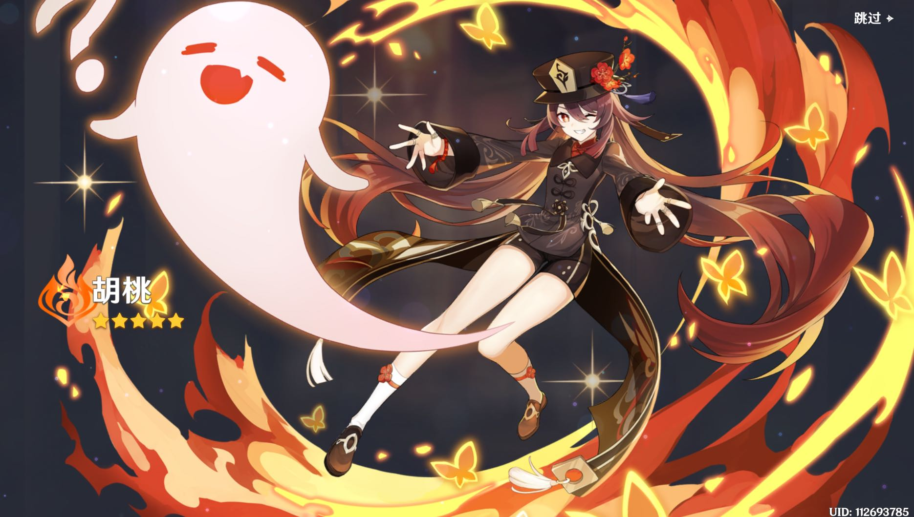

第一个限定五星胡桃女儿

除此之外，**原神也逐渐成为我和小邵之间一个别样的联结**，一起探索、过剧情、抽卡，甚至还被一起拉进了计 8 的原神群hhh 原神的角色构建也无疑是成功的，每一个都深深烙印在我们的心里，常常成为我们聊天的话题。虽然随着主线的结束，每天原神能做的事情也越来越少，但能看到制作组对每一个版本的用心，一起看前瞻直播都已经成为给生活加油的一种独特方式。每个版本活动都有着丰富的剧情设计甚至文化传承，海灯节在游戏中都感到了浓厚的节日氛围。也是真心希望原神之后能越来越好，期待旅行者的足迹踏遍提瓦特的日子。

这一年也和隔壁导更多投身了竞技游戏。从前半年的 Apex，到后半年的守望先锋，感受到这些游戏还是一起打更快乐。之前自己打守望总是越打越气，下班来娱乐的反而把心情弄遭了。随着毕业的脚步越来越近，之后一起开黑打游戏的日子估计很难再有了，有机会的话还是希望多在一起杀几局。此外，**双人成行和底特律变人**也让我们印象很深，都是和小邵一起通关的游戏，其中双人成行体验尤为不错，最后也不出意外地拿到了年度最佳游戏，还是小邵通关的第一个游戏，非常有纪念意义hhhh

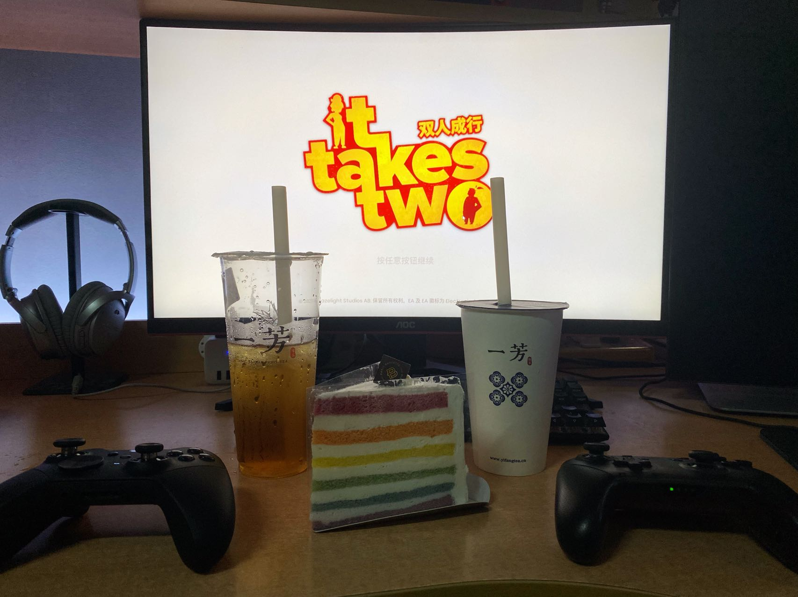

下班回寝室开启双人成行

---

### 科研

这一年的科研说实话并不是很顺利，没有什么正反馈，**从去年 WSDM 到现在，还没有正经中过论文**。先是年初投 SIGIR 觉得必中的对比学习+序列推荐的工作，最后竟然被 weak reject，这给了我当头一棒，老师和师兄们也都觉得很诧异。这一篇后来改投 TOIS 也并不顺利，已经两次 major revision 了，到现在也没有发出去。除此之外，中间还同步做了两个工作，一个是中移动的合作项目，面向多兴趣推荐；另一个是自己的想法，用 feature decorrelation 做无负例协同过滤学习。这两篇也是做的过程中感觉良好，分别投了 AAAI 和 TheWebConf，结果都没有中。AAAI 拿了个高于 borderline 的分，但因为今年接受率低没有中；TheWebConf 则拿到了比较离谱的评审意见，一个非核心创新点的地方被 argue 跟之前工作雷同，感觉是写法的问题，虽然知道是审稿人的问题大一些，但被这样 argue 心里还是颇为不舒服，缓了好一阵才调整过来。这两篇现在都修改后投到了 SIGIR，说实话并没有太大的信心。年末的时候还另外有一个 idea 比较 work，回家后算是赶出来一篇 KDD，这篇整体来看还是挺漂亮的，simple but effective，只是不知道对不对 KDD 的口味。

这么长时间没有正反馈让我变得十分没有信心，有点畏手畏脚的感觉。说实话感觉我们组的**科研氛围越来越不对了**，马哥出站之后尤甚。基本丧失了传帮带的传统，大家都在各自为战帮老师做项目，老师目前也不具备指导具体科研和提供 idea 的能力，反而会提一些不切实际缺乏统筹考虑的问题，并且经常在打压和否定，但没有给出有价值的改进方向，严重影响初入组同学的科研进度。我认为老师和各大公司现在对我们组能做到的事情有过高的估计，已经并不是我们力所能及能做的事情了。由此就一直要重复画大饼、做不出来、糊弄结项的过程，成为高年级博士生之后对这些的感受更为深刻，这让我非常厌烦。我讨厌这种两脚踏在空中的感觉，做不出实际效用又要吹嘘自己做到了。还不知道明年师兄们都毕业了，我变成大师兄的时候要怎么办。现在只想多糊弄糊弄项目，让老师认识到我不擅长这个，从而之后少承担一些这方面的职责。

当然这一年也不是完全没有正反馈，比如上半年在之前写的框架上又做了一些完善，应老师要求写了一个中文的论文，没想到后来不仅中了 CCML 和软件学报，还答辩拿到了 **CCML 的最佳学生论文奖**。虽说这个奖含金量比较低，但还是挺开心的，答辩时候的表现也确实自我感觉不错。而且这个论文本来其实是很不愿意写的，最后勉强写出来，也算是意外之喜了，再加上推荐发表的软件学报竟然算清华 B 类，还是挺赚的。

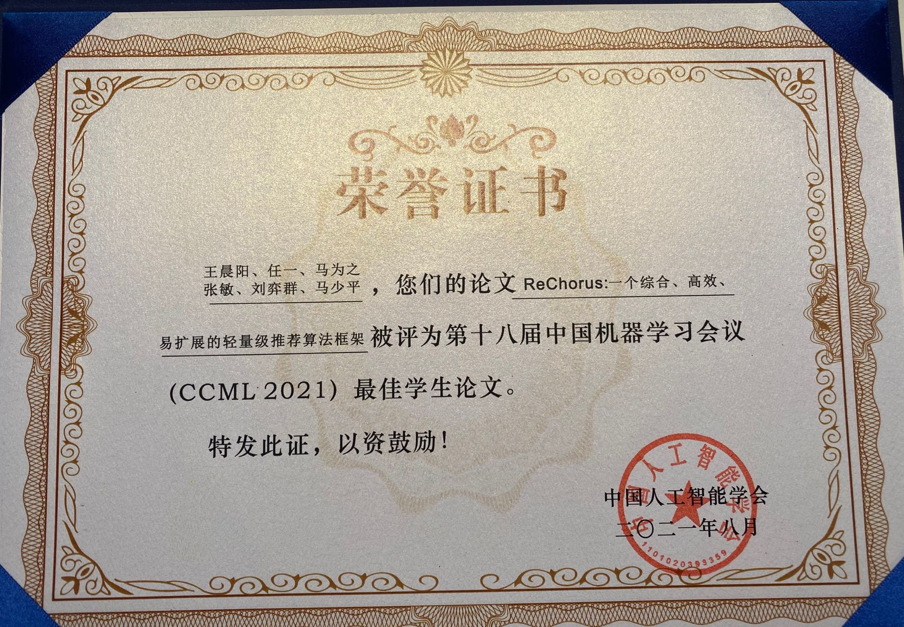

CCML Best Student Paper

另外这一年承担了不少带本科生的工作，陆陆续续在我这里进组的本科生有六个，前后做了三四个项目。这几次的经验让我感受到本科生科研并不是一个简单的事情，相应的很多流程有待完善，比如什么项目适合本科生参与，什么项目不适合。我目前的感觉来看，最好是 **idea 已经有所进展，剩余一些明确任务，并且有产出目标的项目**。首先如果是老师或者博士生都还没有想法的任务，让本科生一起来探索更不可靠，这过分依赖招到的本科生个人能力。就我的感觉而言，当我自己没有想法的时候还要给本科生想要做什么，是非常痛苦的，等于无形中给自己施加了一层压力。其次是项目最好有明确的的产出目标，如果没有这个 target 在，博士生和本科生都会失去动力，觉得没有必要在这个上面浪费时间。这些都是从我个人的经验总结出来的，第一个带的素质教育项目就属于我没有什么想法，带着两拨人瞎搞最后什么也做不出来；第二个框架开发的项目有想法，但没目标，导致有两个同学都中途退出了；后来中移动和无负例这两个项目吸取了之前的教训，都是在我已经尝试出初步结果的时候招本科生，这样就有明确的任务，比如测试新的数据集和 baseline，也有明确的投稿目标，整个体验还是不错的，相比自己一个人奋战论文要快很多，同学们也都比较有动力。但这样论文中与否又给了我更多的负担，没有中的话会让我觉得辜负带的同学们，只能希望带同学做的这几篇有个好结果了。这个过程也让我觉得系里对于本科生科研应该给予更多的指导，我作为博士生可以允许带的一些项目失败，对我的影响不大，但对于进组的本科生来说，他们本科期间的科研经历非常宝贵，特别是出国的同学，如果是一些很难出成果的项目就会耽误申请的黄金时期。有一个大二同学在我这里做了几个月，最后还没拿到老师推荐信，这让我难免觉得有点愧疚。希望组里之后能建立更完善的传帮带机制，慎重选择本科生参与的项目，所谓宁缺毋滥。

---

### 社工

这一年在社工上说实话没有付出多少精力，到大四了类似军训、专项、一二九这样面上的事情少了很多，核心班委会甚至都没怎么开，基本上处于配合完成规定动作的状态，不过还是有几个方面值得一提。

一个是个别人方面，有了一段很多人可能永远不会有的经历。清明假期在家突然接到学生组长的电话，说我们带的一个同学高坠身亡了。那一瞬间脑子是懵的，但让我感觉些许凉薄的是，内心首先涌上来的并不是痛心和惋惜，而是我们作为辅导员对这个同学并不是很了解该怎么面对家长。虽然如此，也只能尽力配合系里做工作，在家的假期就这样没有了。这期间只有李导一个辅导员在学校，真的感觉很辛苦李导，最后我也提早回去了两天，见到李导的时候真的感觉万分憔悴。整个过程随着调查的深入，更加令人痛心疾首，**也许每个同学都有被看似不至于的事情压倒的可能**。好在整件事情处理地还比较顺利，家长也没有无理取闹，我们辅导员并没有直接接触家长，感觉最后算是有惊无险地结束了，这期间也是人生第一次写悼词，那种感觉着实不好受，希望之后不要再有了。除此之外，到了大四各种各样的个别人也逐渐多了起来，有学习上困难的，有心理上抑郁的，还有触及退学家长不择手段申诉的，种种事情总是会影响到自己的心情，更加依赖于自身的调节。

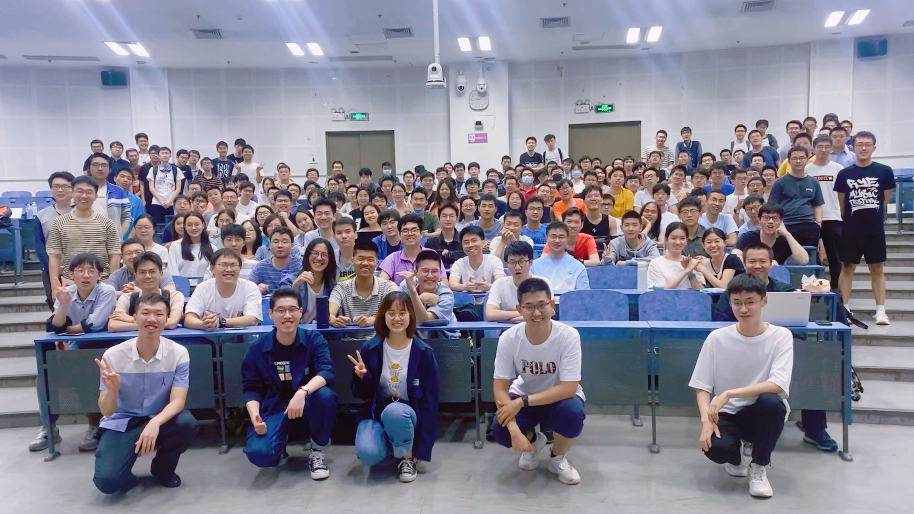

告别李导的年级会

另一个是**辅导员团队的变化**。年中的时候李导就毕业了，关于李导找工作这其中也有太多辛酸的故事，作为室友深感惋惜，那个阶段也难得交流了很多，好在最后有一个还可以接受的去处。这之后又来了两个辅导员，非常年轻的侯导和比我们大一届的杨导。说实话杨导来之前我们是挺抵触的，实际接触起来倒稍稍有所改善，虽然工作能力和脑回路上还是感觉不太行，但真的给人很热情的感觉。侯导则一如既往地靠谱，很多事务性的工作都委托给侯导了，也做得非常出色。经过半年的磨合，感觉现在逐渐也配合更加默契了。最后一年大四下可能会有很多毕业相关的事情，还是希望最后的阶段能更多付出一些，之前也有一些关于毕业的纪念活动的想法，争取能跟同学们一起落实一下，为大学的最后一学期画上圆满的句号。

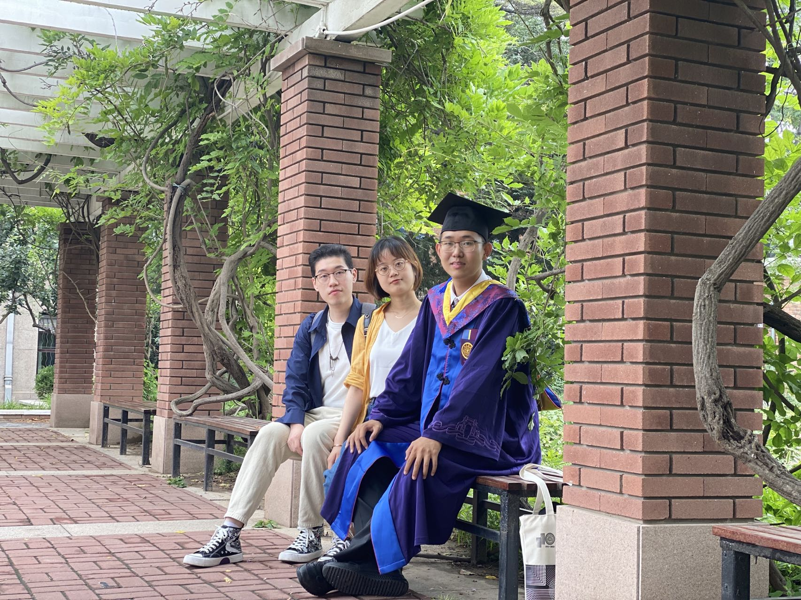

李导毕业合影

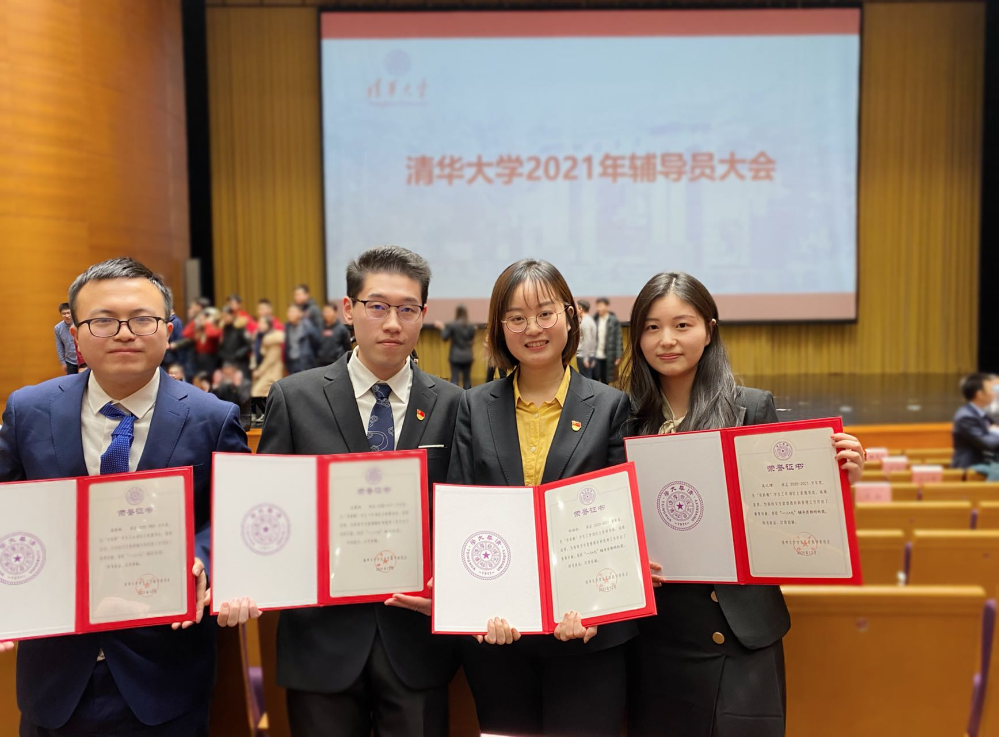

“一二·九”辅导员领奖

---

### 其他

#### 旅行

这一年虽然仍然有疫情的影响，但还是去了不少地方，除了五一去成都的表白之旅，七月还跟着小邵去上海参加「学术交流」，顺便去了迪士尼，拍了很多美美的照片。去迪士尼的那天也是非常难忘的，**晚上的烟火绚烂而美好，让人忍不住在夜色中相拥**，回去也顺利完成了生命的大和谐。此外，上海的早餐锅贴、高达都给我留下了很深的印象，也借此机会跟在上海的高中同学聚了聚，整体对上海的印象很不错。并且从上海回来后，因为寝室中转的原因，还偷偷在玥悦姐家跟小邵同居了一周，开启短暂的没羞没臊的同居生活。每天一起醒来、一起做饭、一起上班下班的生活惬意且舒适，现在想起来还是很怀念。

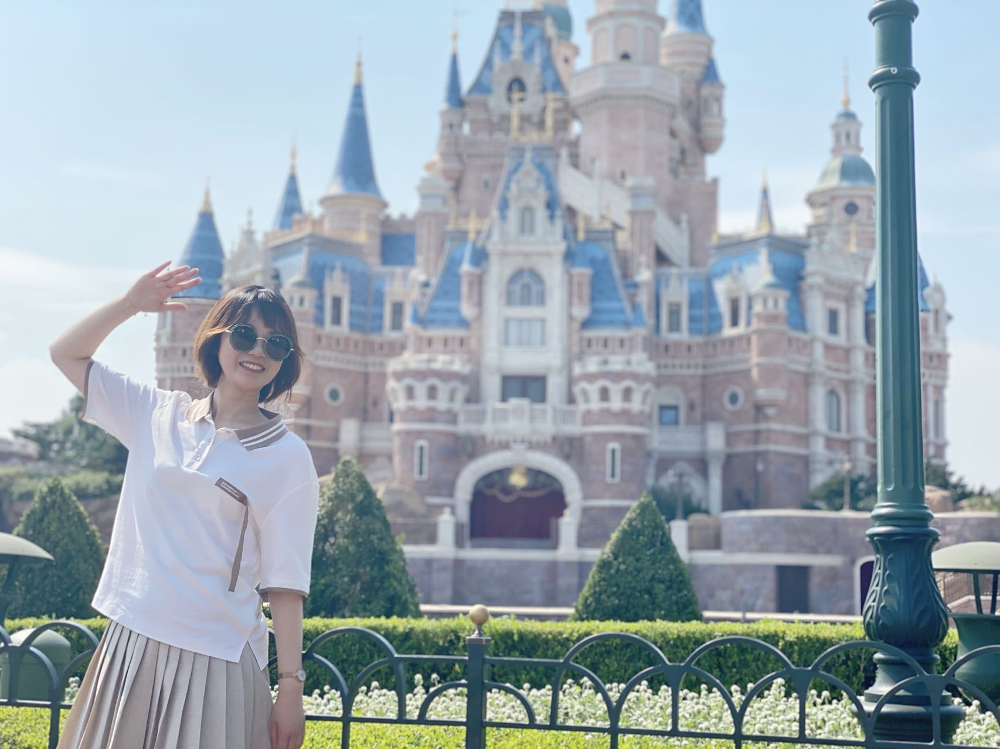

上海迪士尼

这之后在小邵九月生日期间，我们又去了临近的天津，跟小邵一起逛吃逛吃，选择的酒店和饭店都非常不错，也玩得很愉快。最难忘的还是给小邵送生日礼物，精心设计的奖状效果很不错hhh

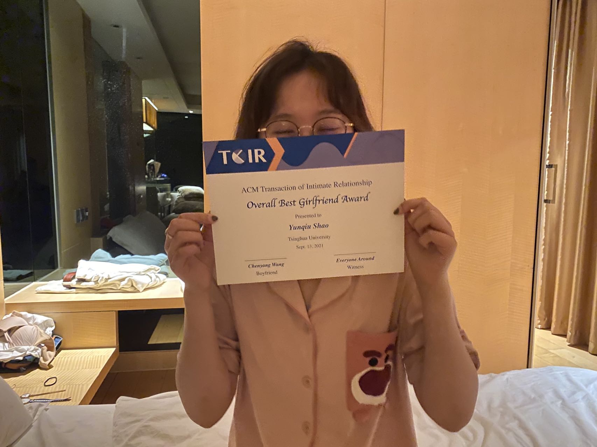

在天津送上独特的生日奖状

此外，寒假期间还到小邵的家乡南通做客，第一次见家长还是非常紧张的，提前跟好多师兄师姐打听注意事项，又谋划了好久送什么礼物，最后感觉还是比较成功的，带的礼物有通用的有特化的还有河南特产，叔叔阿姨对我也都十分照顾，能感受到**小邵成长在一个充满关爱的环境中**。在小邵日常生活的家里共同起居，走过小邵小时候熟悉的街头，参观小邵学习和成长的校园，有种难言的感慨，之前脑海中想象的画面逐一具象化起来，感到离小邵又近了一点。回家的时候叔叔阿姨给包了大大的红包，还请假来送我，非常感动。

#### 校园生活

清明假期回来的时候心血来潮替补其他同学去跑了个校园马拉松 10km，上次跑要追溯到大三的时候了，虽然最后还是没跑进 1h，但还是比之前要快的。而且不像上次最后几圈因为鞋磨脚，每一步都痛苦万分，结束之后下楼梯还抽筋了，这一次跑完非常舒畅，中午还能去聚餐，体验很不错。

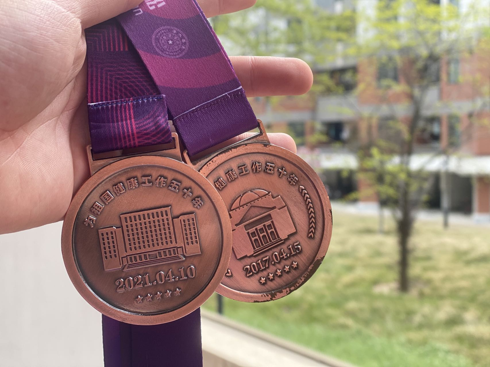

校园马拉松 10km 奖牌

暑假的时候帮小邵搬了寝室，从紫荆公寓搬到博士生单人寝室。前后折腾了很久，搬的过程倒没有想象中那么辛苦，而且新寝室在经过了一段时间磨合后还是挺不错的，至少睡觉非常方便hhh 之前没有搬寝室的时候经常找不到一个能安心约会的地方。

这一年还经历了电动车的更迭，当年图省事上临时牌的四年使用期限转眼就到了，没想到小牛牛还这么坚挺，十分不舍得它。但为了上白牌，不得已换了一辆小小牛，**炮换鸟枪了属于是**。不得不说还是挺不习惯的，一分价钱一分货，小小牛总是有各种各样的问题让我怀念之前的小牛牛，像续航、带人体验、电池位置什么的都不尽如人意。而且当时上的校园内电子标签也没法继承到其他车牌，现在已经没法合法停在宿舍区了，虽然最近的停车点也不远，但毕竟曾经沧海，总还是感觉不方便。希望毕业之后能顺利逃离北京，到时候要买个好点的电动车。

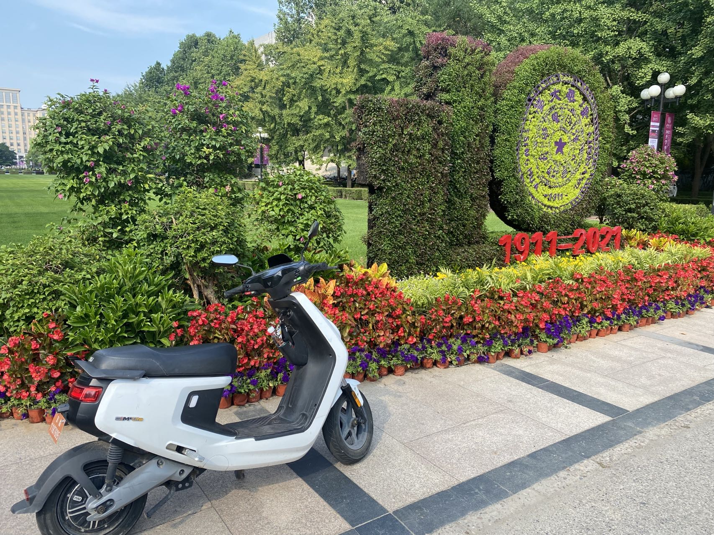

陪伴 4 年的小牛牛

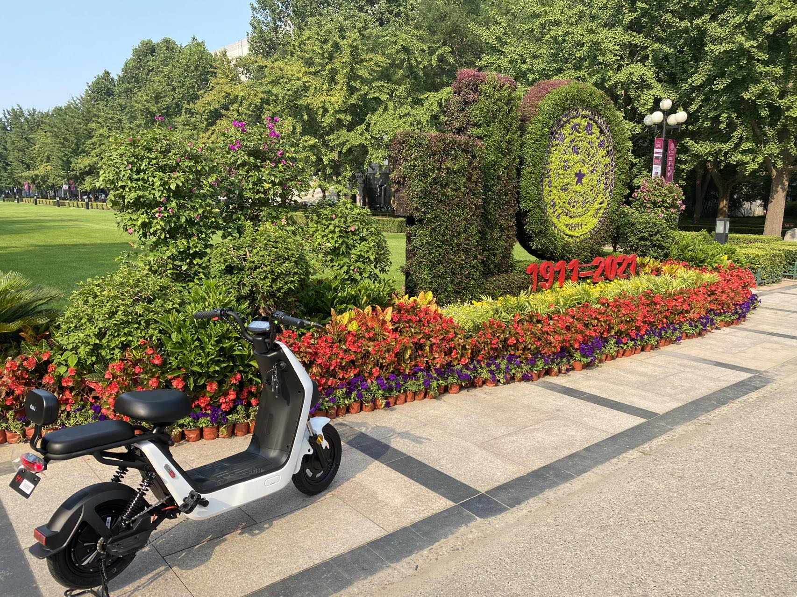

新上任的小小牛

#### 集中隔离

这次回家也算是一次独特的经历了。为了回来不被隔离专门改签了车票，不从有中风险的上海经过，转而从徐州转车。然而千算万算还是没料到就在回家那一天北京升中风险了，而我离开北京不足 14 天行程码上还有北京。回家下高速的时候我就生怕防疫人员检查，趴在后座上不敢露头，好在没有检查我的行程码，以为躲过了一劫，结果回家没过两天社区就打电话要求集中隔离 7 天。就是因为之前经过的北京南通都是低风险，所以非常详细地跟社区进行了报备，结果就成了需要隔离的证据。而且按要求从中风险所在地其他区返回是只需要居家监测的，就在我回来的这一天因为北京升中风险，平顶山政策私自收紧，要求北京回来的至少集中隔离 7 天，中风险对应区回来的隔离 14 天。这个政策在我隔离结束没多久就取消了，也就是说我提前一天回来或者晚回来几天都不用隔离，结果正好就赶上了，非常惨。

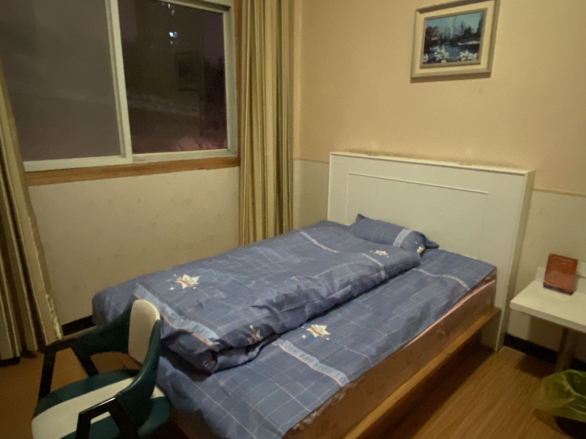

隔离酒店环境

但没有办法还是要遵从规定去隔离，在家附近的一个快捷酒店，好在都是公费不需要掏钱。然而隔离的条件却一言难尽，刚开始非常冷，晚上睡觉都能冻醒，被子也特别小，根本盖不严；饭菜不敢恭维，只能说能填饱肚子，主食给的很多，菜品不是全素就是肉特别咸，只有偶尔几顿是还可以接受的；再加上网络非常差，基本用不了，在这边用掉了几十 G 的流量。总之生活条件很差，冷的问题让家里帮忙带了毯子和热水袋基本解决了，但吃饭一直不太合胃口。不过能感受到这边医护人员和后勤组也不容易，在群里拼命想调动气氛，中间小年还改善伙食吃饺子和芝麻糖。虽说在这隔离的经历不是很开心，但心态慢慢也从刚开始收集证据每天举报变成了逐渐接受。这个过程中也算是学习了一下常用的举报途径，虽然最后没起到什么作用hhh 我也趁这段时间安心写完了 KDD 的论文，算是闭关修炼了。

#### 未来规划

从这个寒假开始，找工作的事情就逐渐提上日程了。这一年见证了师兄师姐的找工作历程，感觉找教职真的不是一件容易的事情，陈冲这样拿奖拿到手软的博士生都拿不到上海交大的 offer，头部高校的教职名额还是太卷了，除非接受北理这样稍微第一级的学校。并且从教职的薪资来看，可能也很难支撑我们两个没有什么家底的人在大城市买房，总不能让小邵在外面辛苦赚钱，我作为男生拿稳定的低薪还是不太符合我的期望，感觉也有可能成为之后的家庭矛盾。所以**综合来看教职现在在我这的优先级并不是很高**，屡次科研的经历也让我觉得我做不出来真正能推动领域进步的工作，如果还是像现在一样水一些 trivial 的 idea，做验证性的工作，感觉会逐渐失去对自身工作意义的认可，这对我来说是非常恐怖的，我还是更喜欢看到所做的东西带来的实际效益。并且从这些年来的科研来看，我就没有一个工作是第一次投出去就中的，也许我真的不太适合科研这条路，现在的我还是更想到一个互联网大厂打工。这样的话暑期实习马上就要到投递简历的时候了，城市的选择、公司的选择、部门的选择都是未知数，要在接下来的这段时间多多收集信息，并且努力准备了！

---

### 总结

总的来说，这一年在感情生活方面非常开心，然而在科研等其他方面并不是很顺利。总结不足的话，不觉得今年在**主动与人交流和增强输入方面明显有所退步**，和小邵在一起后更不愿意主动和身边其他人沟通了，也很少会想以前那样主动去收集信息、学习新知识。希望新的一年首先能继续保持和小邵的甜蜜，马上要来到我的城市结束异地，随着时间的临近万分期待；其次作为未来规划关键的一年，还是要厚着脸皮多多与人沟通，尽可能广泛地收集信息，也让自己多了解一些各方面的知识，减少不必要的内耗。新的一年，可以想见是非常丰富的一年，有带的同学毕业季、有暑期实习、有新的寝室、有旅行计划，希望都能和小邵一同度过，冲！
