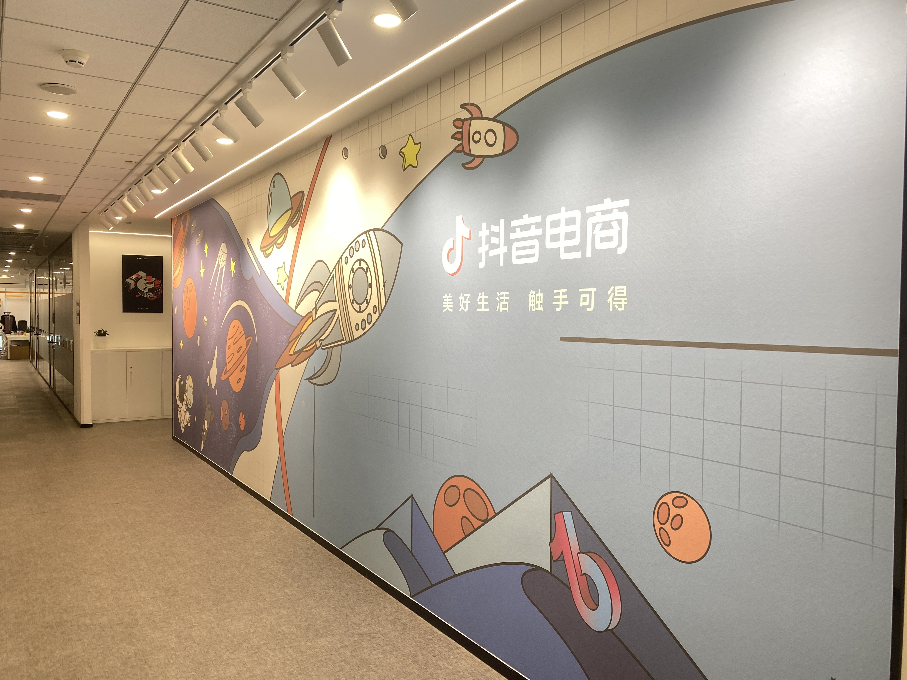
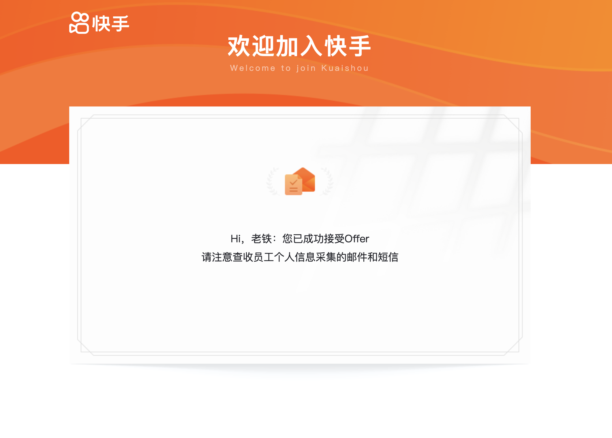
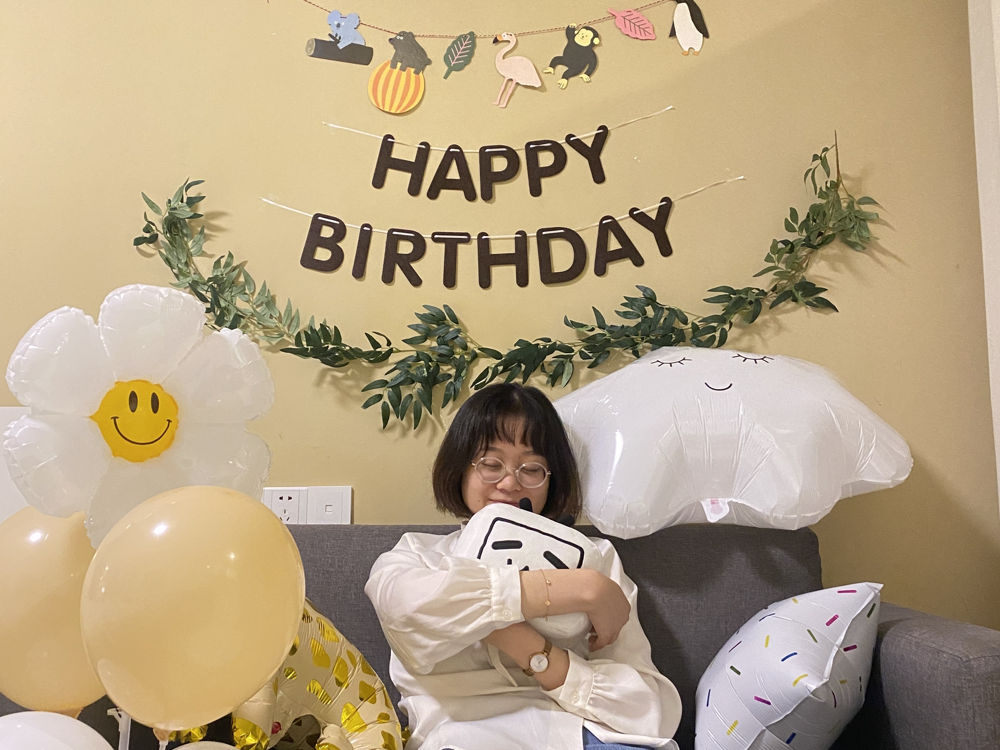
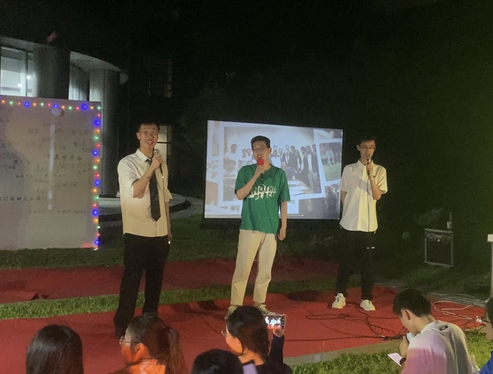
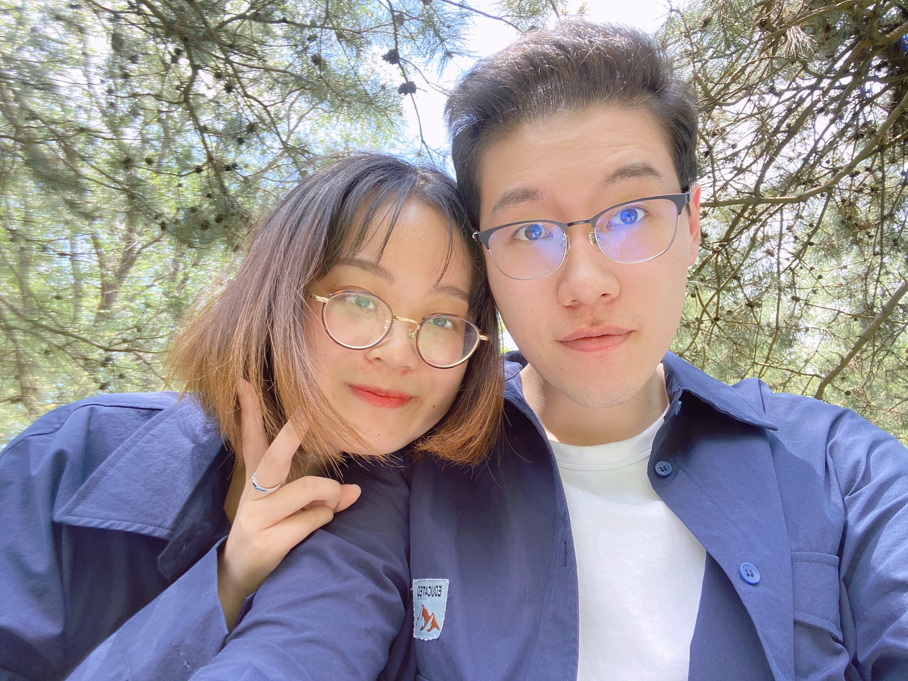
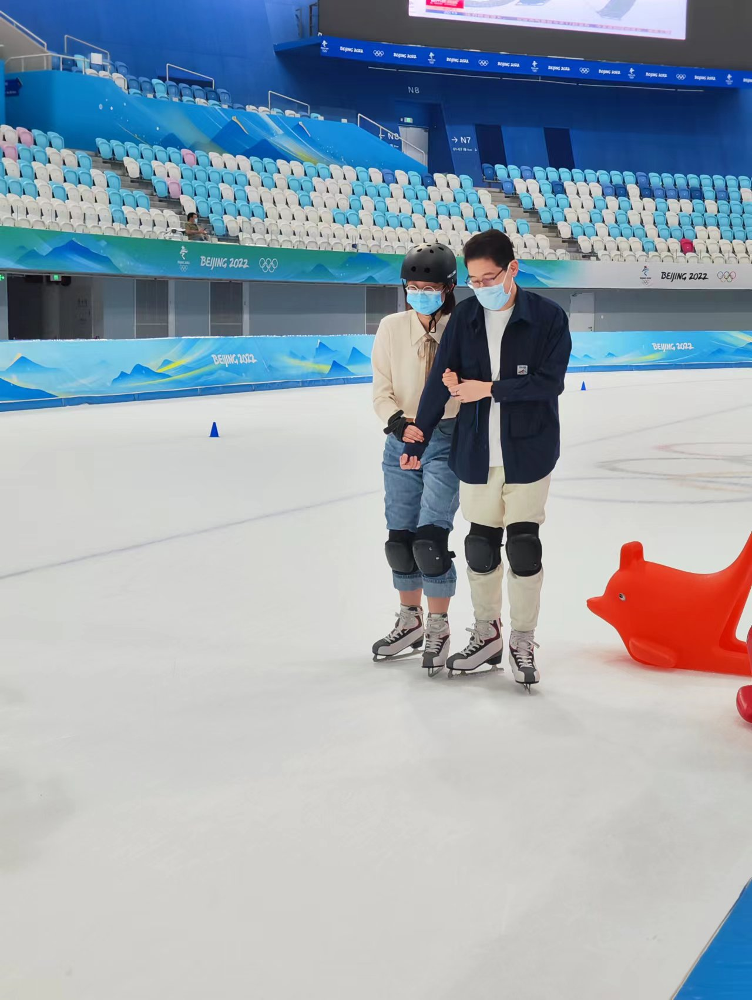
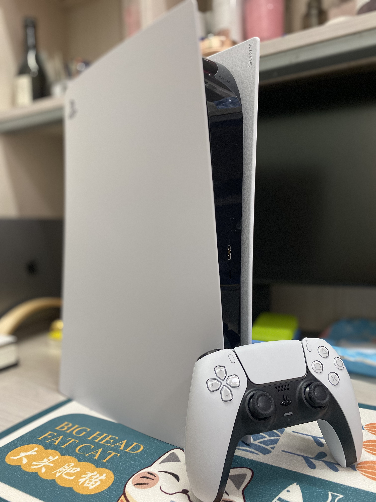
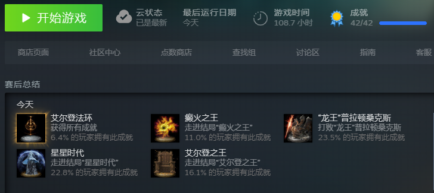
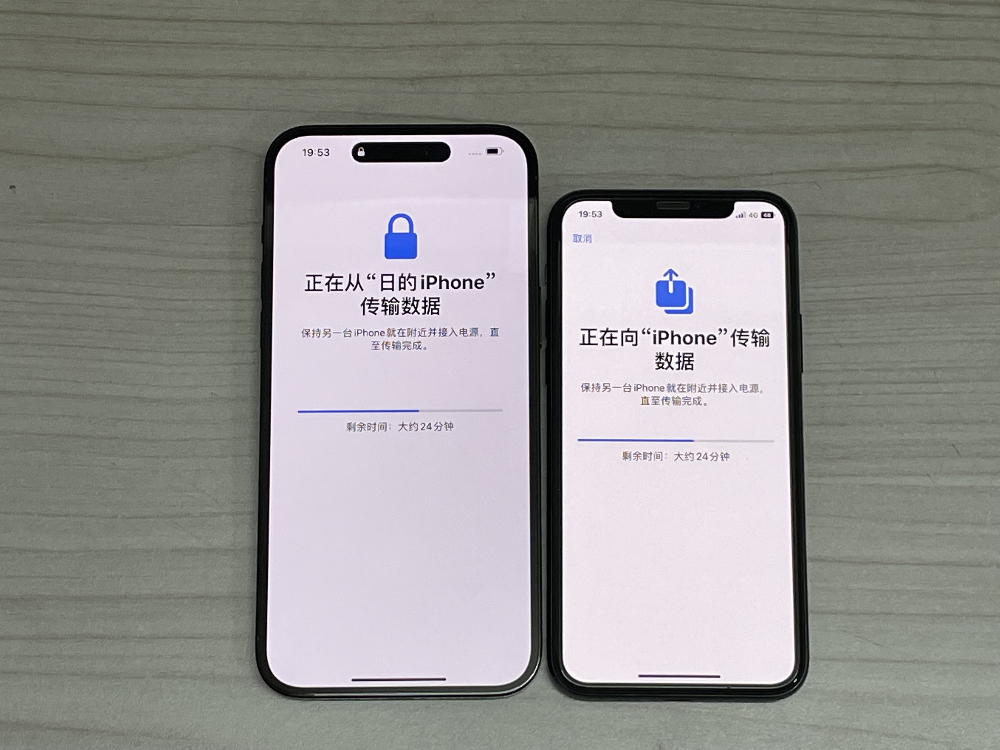

去年写年终总结的时候就预料到，2022必然是非常丰富的一年，可以预见地会发生很多事情。这一年先是送走八字班卸下辅导员身份，紧接着和小邵来到上海实习，经历艰难的返校后又迅速投入秋招，同时还要保证毕业与科研项目的基本盘不动摇。其中各个阶段都遇到了不少困难，但也有一些意料之外的收获，可谓是关关难过关关过了。

---

### 工作

要说之后回忆起2022印象最深的，恐怕就是秋招了。一方面今年互联网就业形势严峻，另一方面整个秋招旷日持久，从寒假回到学校开始，一直到现在还没完全结束，可以说贯穿一整年也不为过。回想起来，竟一时间不知从何说起，只记得每个阶段的心境都不一样，之后考虑专门写一篇记录这一年的秋招经历。

总之经过初期的简历准备与刷题、暑假在上海抖音电商的实习、以及后半年密集的面试，最后还是很幸运收获了诸多offer，有字节的2-2、快手的kstar、腾讯的大咖计划、小红书的red star，还有美团北斗和华为天才少年没开，已经开的几家基本都开到了150w总包，可以说是受宠若惊了。

抖音电商暑期实习

但人真的是永不满足，最开始看整体的就业形势，想着有100w以上的offer就肯定心满意足地接了，但现在又开始纠结各家的工作氛围与未来发展，权衡利弊患得患失，可以说寒假的这一两个月时间都浪费在内耗上了。这期间也找了很多学长学姐，大家各有各的观点，确实每一家也都有各自的优势。最后轮到我决定的时候依然十分困难，深感自己是一个不擅长做抉择的人，或者说一路走来的经历过于追求完美主义，但生活更多的时候并不存在全局最优的选择，甚至连贪心的启发函数都很难定义。有时候经常问自己，我看重什么，但我回答不上来，好像一直以来在一条既定的路上默默奋斗的经历让我还没有形成自己的价值判断，而是用社会化定义的好与不好强加到自己身上。当辅导员的时候经常说让同学们想清楚自己想要什么，但自己其实也一直没想清楚。

但不管怎样，最后我还是带着一些直觉做出了选择，打算年后签快手了。背后的原因也很复杂，确实从业务上来说，整体快手的发展目前看起来不如字节小红书，甚至不如腾讯视频号，但暑期实习的经历让我感受到业务并不一定重要，团队和人才是最重要的。选择快手就是因为+1 leader是之前佩服的大师兄，并且+3 leader和实验室有合作，之后可以利用的资源更多，向下有人保底，向上话语权较大，这个外部环境对于我来说可以说是最舒适的一个了（人脉积累）。并且快手技术成熟，新人培养也有耐心，能够较好地丰富个人技术视野，考虑到之后想要去其他公司成为技术负责人的发展规划，这种工业场景下的技术提升与认知培养是很重要的（领域深度）。而相应的也需要承受一些挑战，比如业务提升困难、团队人数多比较卷等等，不过这种情况下leader的预期也会降低，只要团队氛围是大家一起讨论向前，反而更能够坐得住解决一些长线问题。这其实也是一个小心思，感觉其他家对我的期待都无限高，而我很怕预期高于实力的那种感觉，不希望一进入职场就受挫，发现丢给我的问题都解决不了。而在快手有大腿抱容错会更高一点，可能我本质还是一个比较求稳的人，观察之前去快手的同学性格上多少和我有些相似，而他们在快手待得也不错，相信之后也不会后悔这个选择的。

接受快手offer

### 科研

这一年说实话其实没怎么科研，不过比较幸运的是之前攒下来的两篇论文这一年都中了。一个是去年回家集中隔离期间写的推荐中的对齐性与均匀性，有幸中了KDD，这也是有史以来第一次我的论文一投即中，说实话还是让我非常兴奋的，终于有了一次做出满意的工作并且投稿也顺利的完整体验。

另一个是之前和中移动合作的多兴趣论文，辗转投稿一年终于中了CIKM，分数还都挺高，相比之前投稿的版本其实并没有怎么修改，深感投稿还是运气成分占多数。这一篇的中稿可以说是之前科研的一个里程碑，所有手头的工作都发表了。

本来以为这之后可以告别科研了，但没想到中移动的项目还是需要救场，关于引入商品质量的项目进展不顺，为了交差每天都十分焦虑，最后搞了一个自己都不太满意的问题设定与方法，但也算有点效果，趁过年回家的时间写完投出去了。

另外值得一提的是，今年暑期实习回来突发奇想要给实验室贡献一些基建文档，营造科研上传帮带的氛围，方便新人快速上手以及学习经验。然而最后真正落实的其实只有周报模式的改革，改成了按项目维护，并且也更有连贯性了，其他方面则在事情多起来之后不了了之，现在想起来还有一些愧疚感，牵头人不积极大家肯定也没心气去做，希望明年写完博士论文能有时间再推一推这个事情，最后为实验室留下些什么。

此外作为现在组里唯一的大师兄，感觉没有承担起我一直设想中大师兄的作用，一方面没有积极了解大家所做的项目，另一方面跟大家来讨论时提供不了什么有insight的想法，感觉和同学们之间还是有一些隔阂，没有让大家信服的那种感觉。再加上之前招进来的八字班同学性格和预想大不相同，给实验室也带来了不少矛盾，也让我十分头疼又不知如何是好。

总的来说，今年的科研其实没有做出来什么新的东西，特别是后半年让我十分焦虑。虽然可能主要原因是精力都放在秋招上了，但这也让我怀疑自己到底有没有带领团队发现问题解决问题的能力。我一直觉得我很适合做一个副官，能超预期地执行一些明确的事情，但很难主动提出一些有效的方向。

不过前半年的两篇论文中稿还是让我挺开心，也借此参评了不少奖学金，虽然与国奖失之交臂，但意外拿到了龙湖奖学金人智方向的最高奖。还记得答辩那天很慌乱，给小邵布置生日惊喜的难度超预期，一边打气球穿线一边默默练习，最后轮到我的时候还非常尴尬，共享成了带备注的演讲者试图，当着所有老师同学的面读了一遍备注。再加上其他同学也都很强，本来觉得一定GG了，没想到最后竟然真的拿到了最高奖，柳暗花明又一春了可以说，开心地请小邵去沃夫冈牛排奢侈了一把。

给小邵庆祝生日

几年的科研总让我有种不真实感，我深知自己做的东西没有什么实际价值，然而只要有论文，就能成为最靓的仔，成为大家钦佩的对象。这让我有一种行走在云端的虚无感，自身的能力增长与虚荣感的增长不成比例，慢慢开始为了维护一个虚无的“壳”而劳心费神，丧失了自我的充实感，感受不到科研的意义。人智真的是一个滥竽充数成本很低的方向，故事好听，效果难验证，只要有一个好的故事逻辑大家就愿意相信好的效果，但实际往往没有这么理想。虽然慢慢找到了这个领域混得好的游戏规则，但这不是我想要的，我享受内心充实游刃有余的感觉，而不是费心尽力维护一个宏大、随时都可能破的“壳”。希望今后离开这里进入工业界，一切从对实际用户的影响出发，能真正找到内心的平静与意义。

---

### 社工

这一年可以说给社工划上了一个句点，八字班在这个夏天毕业了，最终还是卸下了辅导员这个陪伴我四年的身份。最后一年辅导员的工作还是挺多的，需要排查就业去向、帮助毕业困难同学、物色后备辅导员、协助毕业典礼相关事宜等。除了比较擅长的事务性工作，涉及和人交流的工作都让我挺难办的，还是很难树立一个让同学觉得很wise的形象，因为很多两难的问题我也给不出什么有效的建议。

但整体来说，毕业季还是充满了很多难忘的回忆。给邵导和八字班女生们一起拍照、帮助几个一直负责的毕业困难户顺利毕业、最后一次在学生节舞台上跳舞、在需要带队的毕业典礼那天睡过、在毕业联欢上表演节目、和很多很多同学一起合影......所有这些让我感受到虽然我可能不算是一个人生导师、模范楷模一样的存在，但这四年的付出与联结，还是颇受同学们认可的。

给邵导与八字班女生拍照

在毕业联欢上的表演

此外，后半年还阴差阳错地参评了蒋南翔辅导员奖。当时在字节办实习离职的我接到谢导电话时，我是拒绝的，觉得林枫蒋南翔这种级别的奖从来跟我没有什么关系。今年也是因为阎导不想评林枫，系里才希望我出面评蒋南翔这个针对带班导的奖。然而系里非常坚持，我也最后磨不开面子勉强参评了。虽然准备材料十分痛苦，写一些自卖自夸的话，但没想到最后真的拿到了这个全校仅十名的奖，还是挺出乎意料的，也算是为社工这条路奉上了一个比较完满的总结与谢幕。

回想起来选择担任辅导员还是挺磨练自己的，也是一个相互塑造的过程。我深刻认识到当时的我在老师看来应该是达不到一个带班导标准的，不然系里当时也不会安排我去当一个新设立的宣传辅导员，还是我“撒泼打滚”最后才给我当带班导这个机会。虽然很多能力上都有欠缺，但我比较擅长的是把所负责的一件事做出花，有热情也总有一些新点子，并且追求细致完美，因此还是做出了一些值得称道的事情，在所欠缺的方面也卓有成长。并且最关键的是通过辅导员与小邵走到了一起，也认识了很多辅导员朋友，我想这一定会是一段我一生难忘的经历。

---

### 生活

本着先苦后甜的原则，终于来到了生活的板块。这一年以和小邵在平顶山无忧无虑的七日游开始，现在还会怀念那时的生活，每天只需尽情享受并规划第二天去哪玩，很久没有这么放松的日子了。

返校后，跟小邵进入了感情的平稳期，每天照常一起去实验室、一起吃饭、一起下班娱乐，生活少了一些互相猜测心意的悸动，多了一些融入对方生活的透明和真实。但平凡的生活也需要一些仪式感，我们都尽力想营造一些值得铭记的时刻。周年纪念的时候，恰逢假期，阳光甚好，我挑选了一些照片打印成明信片，一起相约在情人坡野餐，在草坪上拍了不少好看的照片，现在还是我的朋友圈封面。

情人坡合照

草坪上的“照片墙”

暑假期间，我们只身来到上海，体验了两个多月的同居生活，结果一上来就闹了一个大乌龙。我错以为我的工作地点在西南的漕河泾，而她的工作地点在东北的杨浦，于是房子租在了市中心的汉中路。最后发现我的工作地点就在杨浦，两个人就差十分钟的路程，结果大家被迫一起享受一个小时的单程通勤时间，不仅享受不到房补还要承担市中心高额的租房费用，可以说哭笑不得了哈哈。但日常的生活还是十分愉快的，并没有因为同居多出了许多矛盾，在很多生活上的事情也都能达成共识，甚至还挺享受这个过程。工作的节奏和科研不同，周一到周五专心工作，周末就专心玩耍。我们每个周末基本都定下一个玩耍的目标，每周都有可以期待的事情，两个月下来也逛了不少地方，外滩、餐厅周、话剧与舞台剧、珠宝展等等。特别是一些只有上海才有的剧，阿波罗尼亚和不眠之夜给我留下了深刻印象。

沉浸式戏剧《不眠之夜》

到返校开学的时候，还有一个小插曲，就在原定离开上海的前一天，所在街道突然出现了一例阳性，导致无法直接回京返校。于是又临时更改行程回家洗码，也难得在这个时候又回了一趟家。然而就在这期间，学校的政策也收紧了，即使绿码返京也需要在校集中隔离，为了方便面试，我们选择在校外大钟寺附近住了七天酒店，最后辗转接近一个月才回到学校，九九八十一难了可以说。

回到学校之后我还面临着搬寝室的重任，卸任辅导员之后要从二号楼搬出来了，收拾好新寝室还是颇费一番功夫的。这之后的校园生活也还算惬意，虽然无法出京，也去了不少北京周边的地方，环球影城、北海公园、圆明园、动物园、北京展览馆、冰丝带，很多都是之前不那么有意愿去的，但跟小邵一起也有了别样的风味，特别是北海公园阳光下划船晒太阳，以及圆明园的落叶大道，都是不曾想到的美与享受。还有不会滑冰的小邵，扶着我在冰丝带“蹒跚学步”，等真到老了也许也是像这样长征一样搀扶着去买菜，每天买菜做饭休息，这样的日子还真让人有些期待。

冰丝带“蹒跚学步”

但好日子也不长，很快封校的日子就来临了，而且一封就是几个月。这一年也经历了不少与疫情相关荒诞的事情，上半年甚至有一段时间禁止堂食，只能在户外“野餐”。封校后做核酸的频率也是越来越勤，有时每天都要全员核酸，也经历过绕着紫荆篮球场“九曲十八弯”的核酸大队，甚至还出现了学生游行运动。后来北京疫情愈发严峻，学校里也很快破防了，阳性已经不再是珍惜的存在，每天早上睁眼阳性就有可能出现在宿舍楼内，还经历过一次封楼。

总之那段时间人心惶惶，我们也在学校的鼓励下离校返乡，两个人一起回了平顶山，在平顶山又享受了一个月的同居生活，接下来又一起在年前回了南通。这次意料之外的见家长显得从容淡定了许多，不用像去年一样费尽心机挑礼物，也多了一分亲切与熟络。对我而言真的非常感动叔叔的饭菜以及阿姨的悉心照顾，这次来南通完全不冷了，从里到外都很暖和，也希望明年能顺利推进结婚的进程。

--- 

### 其他

这一年在游戏、娱乐上其实没有太多的精力，实习期间连原神都经常忘了上线，不过今年还是更新了不少娱乐设备的。年初买了PS5，成功成为小邵寝室的原神启动器，相比pad体验确实好很多哈哈，而且今年原神竟然开始转运了，到现在已经连着好多次抽卡没有歪了，之前可以史诗级大酋长的评级。另外里面的一些小游戏难得小邵也非常喜欢，像宇宙机器人和太空宇航员模拟，两个人玩起来非常欢乐。除此之外我还自己打通了对马岛之魂和战神4，制作都非常好，但不知道怎么回事现在对于这种大型3A游戏，初期新鲜感过了之后就没有太多玩的欲望了，可能是没有大段大段可以完全放松的时间了。

新鲜出炉的PS5

在PC上我还“废寝忘食”打通了艾尔登法环，每天11点从小邵寝室回来打两个小时，持之以恒两个月终于通关，真的是酣畅淋漓，量大管饱，有挑战性，同时也有探索的乐趣，不愧为年度游戏。为了流畅地游玩老头环，我甚至换了一台3070的笔记本，淘汰了服役多年的老台式，还花大心思二手卖掉了之前的1060和2080显卡。此外也没忍住新款iphone的诱惑，淘汰了我的iphone11 pro，换了iphone14 pro max。这也是我第一次买大屏手机，以前对这种大而沉的手机是非常抗拒的，然而换了之后还真的有不一样的体验，大屏带来的视觉体验完全不同，娱乐的时候也更有捧着玩手机的感觉，总的来说还是相当满意的。

艾尔登法环全成就

iphone14 pro max

寒假回来也开了几款新游戏，最让我满意的是法国团队做的中国功夫游戏sifu，打击的爽快感很不错，而且在游玩的过程中能明显经历几个阶段。初期总是被打死；中期发现一些技巧比如闪避可以一招鲜吃遍天，但有些boss闪避不好使就会被克制；后期则是灵活使用各种技巧追求怎么打得漂亮。这也引发了我一些思考，现在的工作科研其实基本上属于中期，找到了一些门道就不想努力了，但想要追求后期的游刃有余就要破而后立。

---

### 总结

总的来说，这一年经历了多种不同的生活状态，感情稳中有升，工作尘埃落定，科研喜忧参半，对自己的思考和反思更多了一些，但与他人的交流和主动输入还是没有改善。希望新的一年能够做好学校和进入社会的交接，享受自己的毕业季，同时安顿好自己的小家，顺利过渡到工作的状态。也希望能更多充实自己，在新的环境中与更多身边的人主动打交道，开始缩小自己的“壳”，充实自己的内心，享受属于我们的小确幸。
